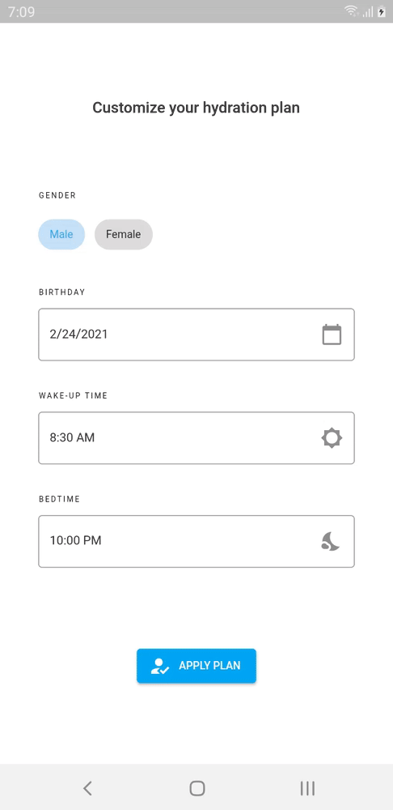

# project goldfish

Final year project. (Work in progress)

## Features

* Track user's water intake
* 3D Aquarium using Unity
* Check history
* Notification Manager
* Local database using SQLite

## APK

[Download here](https://github.com/japhetobsioma/goldfish/releases)

## Preview

## Authors

* [Japhet Mert Catilo Obsioma](https://github.com/japhetobsioma) (Dart, Flutter, SQLite)
* [Shamsul Bin Majid](https://github.com/ShmslMjd) (Unity, C#)
